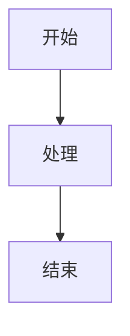
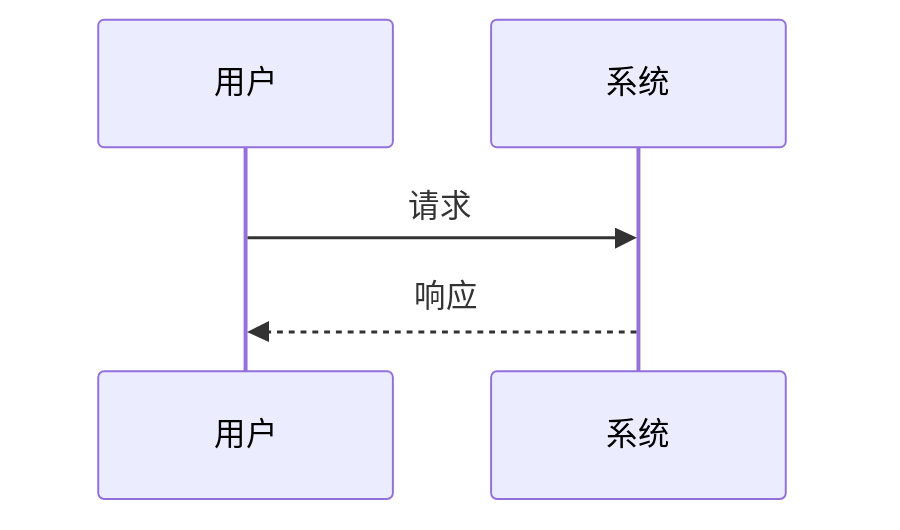
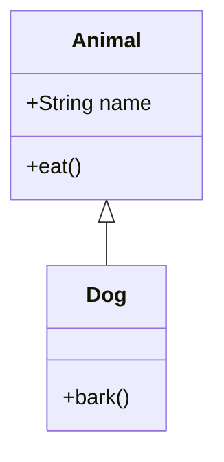
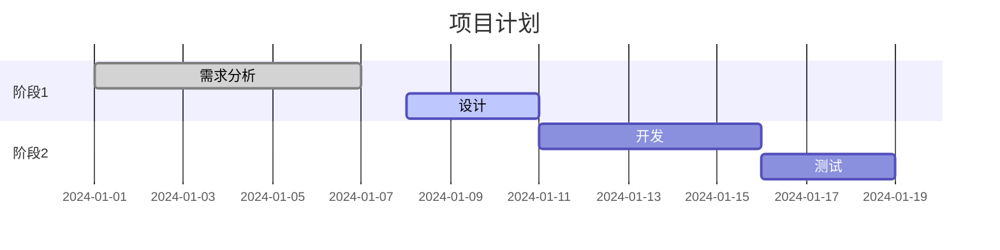
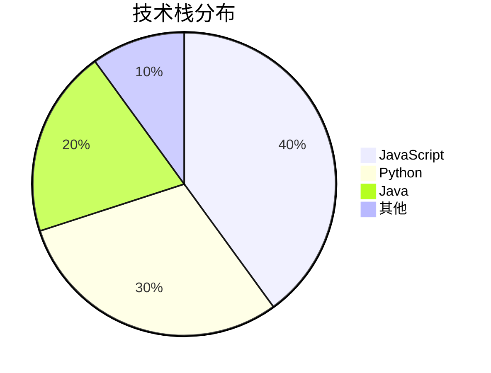

# Mermaid 图表测试

这篇文章用于测试 Mermaid 图表是否能正常显示。

## 简单流程图

```mermaid
graph TD
    A[开始] --> B[处理]
    B --> C[结束]
```

## 时序图

```mermaid
sequenceDiagram
    participant A as 用户
    participant B as 系统
    
    A->>B: 请求
    B-->>A: 响应
```

## 类图

```mermaid
classDiagram
    class Animal {
        +String name
        +eat()
    }
    class Dog {
        +bark()
    }
    Animal <|-- Dog
```

## 甘特图

```mermaid
gantt
    title 项目计划
    dateFormat  YYYY-MM-DD
    section 阶段1
    需求分析    :done,    des1, 2024-01-01, 2024-01-07
    设计        :active,  des2, 2024-01-08, 3d
    section 阶段2
    开发        :         des3, after des2, 5d
    测试        :         des4, after des3, 3d
```

## 饼图

```mermaid
pie title 技术栈分布
    "JavaScript" : 40
    "Python" : 30
    "Java" : 20
    "其他" : 10
```

如果这些图表都能正常显示，说明 Mermaid 配置成功！
