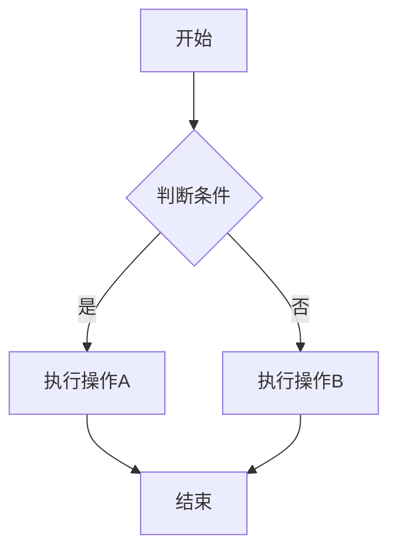
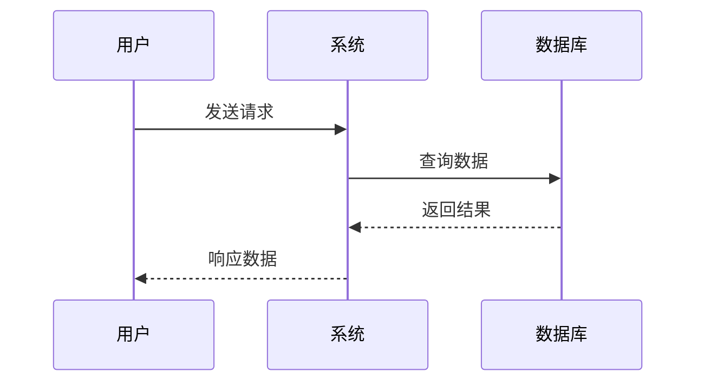
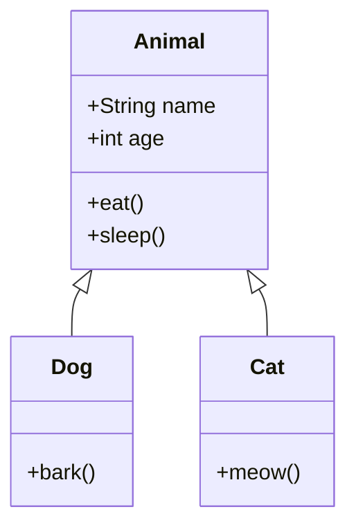

# 内容嵌入示例

这篇文章展示了如何在 Jekyll Chirpy 主题中嵌入各种内容。

## 图片支持

### 本地图片

### 网络图片

## 数学公式

### 行内公式
这是一个行内公式：$E = mc^2$，其中 $E$ 是能量，$m$ 是质量，$c$ 是光速。

### 块级公式
$$
\int_{-\infty}^{\infty} e^{-x^2} dx = \sqrt{\pi}
$$

$$
\begin{align}
\nabla \times \vec{\mathbf{B}} -\, \frac1c\, \frac{\partial\vec{\mathbf{E}}}{\partial t} &= \frac{4\pi}{c}\vec{\mathbf{j}} \\
\nabla \cdot \vec{\mathbf{E}} &= 4 \pi \rho \\
\nabla \times \vec{\mathbf{E}}\, +\, \frac1c\, \frac{\partial\vec{\mathbf{B}}}{\partial t} &= \vec{\mathbf{0}} \\
\nabla \cdot \vec{\mathbf{B}} &= 0
\end{align}
$$

## UML 图表

### Mermaid 流程图

### Mermaid 时序图

### Mermaid 类图

## 总结

Jekyll Chirpy 主题支持：
- ✅ 图片嵌入（本地和网络）
- ✅ 数学公式（MathJax）
- ✅ UML 图表（Mermaid）
- ✅ 代码高亮
- ✅ 表格和列表
