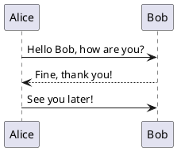
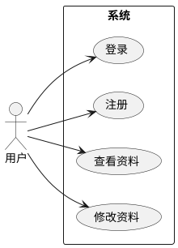
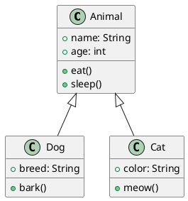
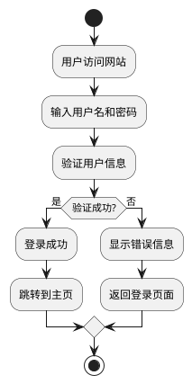
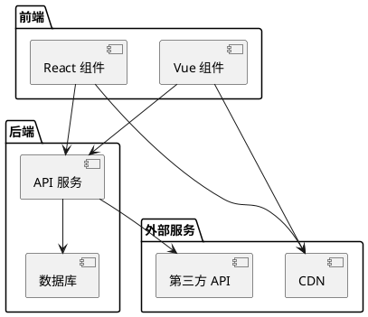
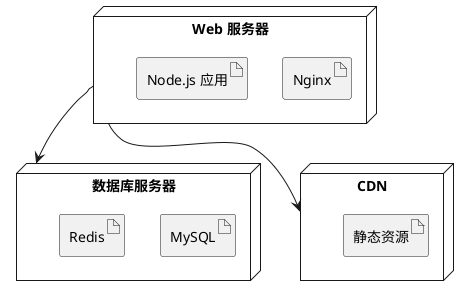
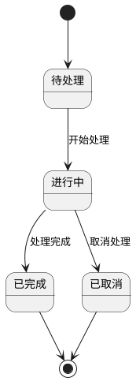

# PlantUML 图表示例

这篇文章展示了如何在 Jekyll Chirpy 主题中使用 PlantUML 绘制各种 UML 图表。

## 时序图 (Sequence Diagram)

## 用例图 (Use Case Diagram)

## 类图 (Class Diagram)

## 活动图 (Activity Diagram)

## 组件图 (Component Diagram)

## 部署图 (Deployment Diagram)

## 状态图 (State Diagram)

## 总结

PlantUML 支持多种 UML 图表类型：

- ✅ **时序图** - 展示对象间的交互
- ✅ **用例图** - 展示系统功能
- ✅ **类图** - 展示类的关系
- ✅ **活动图** - 展示业务流程
- ✅ **组件图** - 展示系统架构
- ✅ **部署图** - 展示系统部署
- ✅ **状态图** - 展示状态转换

使用 PlantUML 可以创建专业的 UML 图表，非常适合技术文档和系统设计。
